<objective>
Create all materials presenters need to deliver a 20-minute GSD demo.

Purpose: Enable reproducible, professional delivery of GSD workflow demonstration to mixed technical/non-technical audience.
Output: Demo script (SCRIPT.md), pre-written responses (RESPONSES.md), GSD workflow diagram (GSD-WORKFLOW.md) in docs/demo/
</objective>

<execution_context>
@~/.claude/get-shit-done/workflows/execute-plan.md
@~/.claude/get-shit-done/templates/summary.md
</execution_context>

<context>
@.planning/PROJECT.md
@.planning/ROADMAP.md
@.planning/STATE.md
@.planning/phases/04-training-materials/04-CONTEXT.md
@.planning/phases/04-training-materials/04-RESEARCH.md
</context>

<tasks>

<task type="auto">
  <name>Task 1: Create demo script with time budgets and commands</name>
  <files>docs/demo/SCRIPT.md</files>
  <action>
Create a complete 20-minute demo script with these sections and time budgets:

**Section structure (must total exactly 20 minutes):**
1. Introduction (2 min) - Context setting, what we'll build
2. GSD Questioning (3 min) - /gsd:new-project, rapid answers
3. Parallel Planning (4 min) - tmux 3-pane setup, simultaneous /gsd:plan-phase
4. Execution (8 min) - Ralph Loop autonomous execution
5. Wrap-up (3 min) - Results summary, Q&A pointer

**For each section include:**
- Time budget header: `**Time budget:** X:XX`
- SAY prompts for presenter narration (concise talking points)
- COMMAND blocks with exact bash/Claude commands (copy-paste ready)
- DO actions for non-command steps

**Tmux setup (from RESEARCH.md):**
```bash
SESSION="gsd-demo"
PROJECT_DIR="$HOME/projects/gsd-training"
tmux kill-session -t $SESSION 2>/dev/null
tmux new-session -d -s $SESSION -c "$PROJECT_DIR"
tmux split-window -h -t $SESSION -c "$PROJECT_DIR"
tmux split-window -h -t $SESSION -c "$PROJECT_DIR"
tmux select-layout -t $SESSION even-horizontal
tmux attach -t $SESSION
```

**Pane commands must use explicit targeting:**
- Pane 0 (left): `-t gsd-demo:0.0`
- Pane 1 (middle): `-t gsd-demo:0.1`
- Pane 2 (right): `-t gsd-demo:0.2`

**Ralph Loop invocation (from RESEARCH.md):**
```
/ralph-loop:ralph-loop "/gsd:execute-phase 1" --completion-promise "PHASE_COMPLETE" --max-iterations 20
```

**Reference RESPONSES.md** for GSD questioning phase (include link).

Mark sections as [CUT-SAFE] if they can be shortened under time pressure.
  </action>
  <verify>
- File exists at docs/demo/SCRIPT.md
- Contains all 5 sections with time budgets
- Time budgets sum to exactly 20 minutes
- All tmux commands have explicit pane targeting (-t SESSION:0.X)
- All Claude slash commands are complete (no "..." or placeholders)
- Contains reference to RESPONSES.md
  </verify>
  <done>Demo script is complete with 5 timed sections totaling 20 minutes, all commands copy-paste ready</done>
</task>

<task type="auto">
  <name>Task 2: Create pre-written GSD responses</name>
  <files>docs/demo/RESPONSES.md</files>
  <action>
Create pre-written responses for GSD questioning phase. The demo uses `/gsd:new-project` which asks about the project.

**Response style (from CONTEXT.md):**
- Minimal/terse tone - short answers, let GSD do the talking
- 1-3 words when selecting an option
- Match AskUserQuestion options exactly when available
- No educational explanations

**Include responses for these common GSD questions:**
1. "What are you building?" → "Pomodoro timer"
2. "Tell me more about [project]" → "25-min work sessions, 5-min breaks. Single HTML file. No dependencies."
3. "Who is this for?" → "Me. Personal productivity."
4. "What does done look like?" → "Timer counts down 25:00 to 00:00. Start/stop/reset. Shows completed sessions."
5. "Any constraints?" → "Single HTML file. No frameworks. Runs locally in browser."
6. Ready to create PROJECT.md? → "Create PROJECT.md" (select the option)

**Format each response as:**
```markdown
**Q: [Question text]**
A: "[Response]"
```

Add a header noting these are for the Pomodoro timer demo specifically.
  </action>
  <verify>
- File exists at docs/demo/RESPONSES.md
- Contains at least 5 Q&A pairs
- All responses are terse (under 20 words each)
- No explanatory text in responses (only direct answers)
  </verify>
  <done>Pre-written responses exist for GSD questioning phase, all terse and copy-paste ready</done>
</task>

<task type="auto">
  <name>Task 3: Create GSD workflow diagram</name>
  <files>docs/demo/GSD-WORKFLOW.md</files>
  <action>
Create a Mermaid flowchart visualizing the GSD workflow stages.

**Diagram requirements (from CONTEXT.md):**
- Visualize GSD workflow stages: Questioning → Planning → Execution → Verification
- NOT the Pomodoro timer architecture (that's not the demo's point)
- Use Mermaid `flowchart LR` for horizontal flow

**Use the Mermaid pattern from RESEARCH.md:**

```mermaid
flowchart LR
    subgraph Discovery["Discovery Phase"]
        Q[Questioning]
        R[Research]
    end

    subgraph Planning["Planning Phase"]
        REQ[Requirements]
        ROAD[Roadmap]
        PLAN[Plan Tasks]
    end

    subgraph Execution["Execution Phase"]
        EXEC[Execute Tasks]
        VERIFY[Verify Work]
    end

    Q -->|"User answers"| R
    R -->|"Domain knowledge"| REQ
    REQ -->|"Scope defined"| ROAD
    ROAD -->|"Phases defined"| PLAN
    PLAN -->|"Tasks ready"| EXEC
    EXEC -->|"Code complete"| VERIFY
    VERIFY -->|"Gaps found"| PLAN
    VERIFY -->|"Phase complete"| DONE([Done])

    classDef discovery fill:#3498db,stroke:#2980b9,color:#fff
    classDef planning fill:#2ecc71,stroke:#27ae60,color:#fff
    classDef execution fill:#e74c3c,stroke:#c0392b,color:#fff

    class Q,R discovery
    class REQ,ROAD,PLAN planning
    class EXEC,VERIFY execution
```


**Add context around the diagram:**
- Title explaining this is GSD workflow
- Brief description of each phase (2-3 sentences max)
- Note that verification loops back to planning if gaps found

**Avoid "end" keyword conflict** - use capitalized node labels.
  </action>
  <verify>
- File exists at docs/demo/GSD-WORKFLOW.md
- Contains valid Mermaid flowchart (```mermaid code block)
- Uses `flowchart LR` direction
- Shows all stages: Questioning, Research, Requirements, Roadmap, Plan, Execute, Verify
- Has colored subgraphs for Discovery, Planning, Execution phases
- No lowercase "end" used as node label
  </verify>
  <done>GSD workflow diagram exists with Mermaid flowchart showing all workflow stages</done>
</task>

</tasks>

<verification>
After all tasks complete, verify:
1. `ls docs/demo/` shows SCRIPT.md, RESPONSES.md, GSD-WORKFLOW.md
2. `grep -c "Time budget" docs/demo/SCRIPT.md` returns 5 (one per section)
3. `grep -c "^A:" docs/demo/RESPONSES.md` returns at least 5 responses
4. `grep -c "flowchart LR" docs/demo/GSD-WORKFLOW.md` returns 1
</verification>

<success_criteria>
- [ ] docs/demo/SCRIPT.md exists with 5 sections totaling 20 minutes
- [ ] docs/demo/RESPONSES.md exists with 5+ terse responses
- [ ] docs/demo/GSD-WORKFLOW.md exists with valid Mermaid flowchart
- [ ] All files are markdown, render correctly
- [ ] No placeholders or TODOs remain in any file
</success_criteria>

<output>
After completion, create `.planning/phases/04-training-materials/04-01-SUMMARY.md`
</output>
