# GSD Workflow Diagram

This diagram visualizes the GSD (Get Shit Done) workflow stages used in the demo.

## Workflow Overview

GSD follows a structured flow from initial questioning through to verified, working software:

1. **Discovery Phase** - Understand what to build through questioning and research
2. **Planning Phase** - Break work into requirements, roadmap, and detailed task plans
3. **Execution Phase** - Execute tasks autonomously with continuous verification

```mermaid
flowchart LR
    subgraph Discovery["Discovery Phase"]
        Q[Questioning]
        R[Research]
    end

    subgraph Planning["Planning Phase"]
        REQ[Requirements]
        ROAD[Roadmap]
        PLAN[Plan Tasks]
    end

    subgraph Execution["Execution Phase"]
        EXEC[Execute Tasks]
        VERIFY[Verify Work]
    end

    Q -->|"User answers"| R
    R -->|"Domain knowledge"| REQ
    REQ -->|"Scope defined"| ROAD
    ROAD -->|"Phases defined"| PLAN
    PLAN -->|"Tasks ready"| EXEC
    EXEC -->|"Code complete"| VERIFY
    VERIFY -->|"Gaps found"| PLAN
    VERIFY -->|"Phase complete"| DONE([Done])

    classDef discovery fill:#3498db,stroke:#2980b9,color:#fff
    classDef planning fill:#2ecc71,stroke:#27ae60,color:#fff
    classDef execution fill:#e74c3c,stroke:#c0392b,color:#fff

    class Q,R discovery
    class REQ,ROAD,PLAN planning
    class EXEC,VERIFY execution
```

## Phase Descriptions

### Discovery Phase (Blue)

**Questioning:** GSD asks focused questions to understand what you want to build, who it's for, and what success looks like. Answers are captured in PROJECT.md.

**Research:** GSD researches the domain, identifies standard patterns, and gathers technical context for planning.

### Planning Phase (Green)

**Requirements:** User requirements are refined into specific, testable criteria.

**Roadmap:** Work is organized into phases with clear dependencies.

**Plan Tasks:** Each phase gets a detailed PLAN.md with atomic tasks, verification steps, and success criteria.

### Execution Phase (Red)

**Execute Tasks:** Claude Code executes each task, creates files, writes code, runs tests.

**Verify Work:** Each task is verified against its criteria. On success, the task is committed. On failure, Claude fixes the issue and re-verifies.

**Verification Loop:** If gaps are found during verification, planning may be revised. This ensures the final output meets all requirements.

## Key Insight

The arrow from **Verify** back to **Plan** is critical. GSD doesn't just execute blindly - it validates each step and can course-correct if something doesn't work as expected.

---

*Diagram renders in GitHub markdown and any Mermaid-compatible viewer.*
